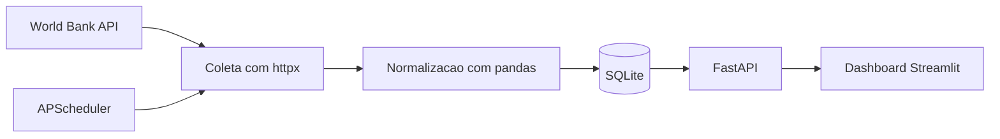
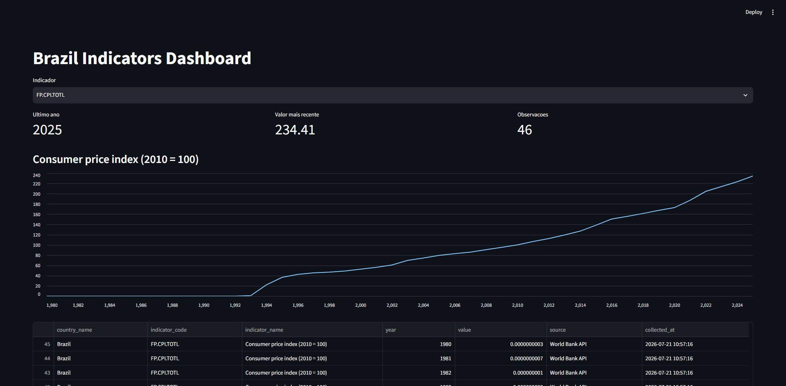

# Data Scraper + API

Pipeline em Python que coleta indicadores publicos do Banco Mundial, normaliza os dados,
armazena em SQLite, expoe consultas via FastAPI e apresenta um dashboard em Streamlit.

## Fonte de dados

A fonte usada e a World Bank Indicators API, uma API publica para indicadores economicos e
sociais. O projeto coleta, por padrao, dados do Brasil para:

- `NY.GDP.MKTP.CD`: PIB em dolares correntes.
- `SP.POP.TOTL`: populacao total.
- `FP.CPI.TOTL.ZG`: inflacao anual pelo indice de precos ao consumidor.

Casos de uso:

- acompanhar series historicas de indicadores macroeconomicos;
- consultar dados normalizados por API;
- criar visualizacoes rapidas para analise exploratoria;
- manter uma base local atualizada por agendamento.

## Fluxo do pipeline



## Como funciona

A coleta usa `httpx` com timeout, `User-Agent` identificado e retentativas com backoff
exponencial. Como a fonte e uma API publica, o projeto nao faz scraping HTML e evita
coletas agressivas. O job recorrente roda a cada 24 horas.

A normalizacao converte ano e valor para tipos numericos, remove registros sem valor,
ordena a serie e deduplica por `country_code`, `indicator_code` e `year`. No banco,
essa mesma chave e usada como chave primaria, permitindo `upsert` sem duplicar dados.

## Estrutura

```text
collector/
  fetch.py         # coleta dados da API do Banco Mundial
  transform.py     # limpeza e normalizacao com pandas
  pipeline.py      # orquestracao coleta -> transformacao -> armazenamento
api/
  main.py          # aplicacao FastAPI
dashboard/
  app.py           # dashboard Streamlit
scheduler.py       # job recorrente com APScheduler
storage.py         # persistencia SQLite
tests/             # testes unitarios
pyproject.toml     # dependencias e qualidade
```

## Instalacao

```bash
python -m venv .venv
.venv\Scripts\activate
pip install -e ".[dev]"
```

No Linux/macOS, use `source .venv/bin/activate` no lugar do comando de ativacao do Windows.

## Executando a coleta

Para rodar uma coleta manual via Python:

```bash
python -c "from collector.pipeline import run_collection; print(run_collection())"
```

O banco sera criado em `data/indicators.sqlite`.

## Executando a API

```bash
uvicorn api.main:app --reload
```

A API ficara disponivel em `http://localhost:8000`.

Principais rotas:

- `GET /health`
- `POST /collect`
- `GET /indicators`
- `GET /indicators/summary`

Exemplos:

```bash
curl http://localhost:8000/health
curl -X POST http://localhost:8000/collect
curl "http://localhost:8000/indicators?indicator_code=SP.POP.TOTL&start_year=2015&limit=20"
curl http://localhost:8000/indicators/summary
```

## Executando o dashboard

Com a API rodando:

```bash
streamlit run dashboard/app.py
```

Por padrao, o dashboard consome `http://localhost:8000`. Para trocar a URL:

```bash
set API_URL=http://localhost:8000
streamlit run dashboard/app.py
```

## Executando o agendador

```bash
python scheduler.py
```

Ao iniciar, o agendador faz uma coleta imediata e depois repete o processo a cada 24 horas.

## Qualidade e testes

```bash
pytest
ruff check .
black --check .
```

## Prints do dashboard



Depois de iniciar API e dashboard, acesse `http://localhost:8501`. A tela principal mostra:

- seletor de indicador;
- metricas resumidas do ultimo ano disponivel;
- grafico de linha da serie historica;
- tabela com os registros coletados.
